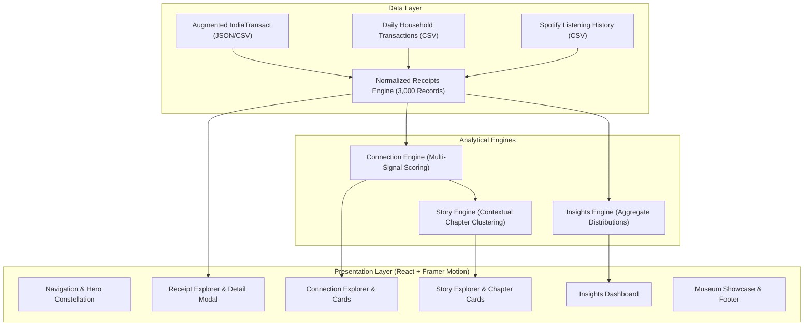

# LifeInReceipts

An interactive digital museum transforming thousands of fragmented transaction and activity records into explainable connections, behavioral patterns, and story-driven chapters.

<p align="center">
  
  
  
  
  
  
  
</p>

---

## Live Demo

Experience the full interactive application online:

**https://life-in-receipts-lime.vercel.app/**

---

## Overview

Modern digital life produces an endless stream of isolated records: contactless card swipes, grocery store slips, commute tickets, streaming history logs, and utility bills. Viewed in isolation, these records look like flat line items in banking apps or listening queues.

LifeInReceipts addresses this fragmentation by converting raw transactional logs into a cohesive interactive narrative. Instead of static tables or passive charts, the platform inspects real metadata across time, geography, merchant categories, and activity sessions to uncover hidden relationships. It processes thousands of individual records entirely on the client, discovering meaningful intersections and grouping related moments into structured, readable life chapters.

---

## Core Experience

The platform organizes information through a progressive four-stage exploration model:

```text
Moments  ──▶  Connections  ──▶  Patterns  ──▶  Stories
```

- **Moments**: Individual receipts, transactions, and media streams normalized into a unified, searchable schema with verifiable metadata.
- **Connections**: Deterministic, multi-signal relationship discovery linking disparate events through shared dates, geographic proximity, session timing, and complementary categories.
- **Patterns**: High-level statistical distributions revealing financial volume, diurnal time-of-day habits, and category frequencies across calendar years.
- **Stories**: Algorithmic clustering of connected moments into chronological life chapters, capturing the context and narrative of everyday life.

---

## Key Features

### Receipt Explorer
- **Multi-Dataset Browsing**: Direct access to 3,000 normalized records across three heterogeneous data sources.
- **Full-Text Search**: Real-time filtering across titles, subtitles, merchant names, artists, and descriptions.
- **Faceted Category Filtering**: Dynamic filter chips reflecting category frequencies across 47 distinct classifications.
- **Dataset and Value Toggles**: Instant segmentation by source dataset and pricing status (paid vs. free/streaming records).
- **Flexible Sorting**: Reorder records chronologically, by transaction amount (highest/lowest), or alphabetically.
- **Receipt Detail Modal**: Comprehensive inspection drawer displaying verified raw timestamps, merchant classifications, card verification data, locations, and raw metadata.

### Connection Discovery
- **Multi-Signal Engine**: Evaluates pairs of events using temporal proximity, geographic overlap, and category affinities.
- **Transparent Scoring**: Every connection carries an explainable additive score (from 3 to 7+ points) and an itemized list of contributing factors.
- **Strength Classification**: Immediate categorization into verified connection tiers based on mathematical confidence.

### Story & Life Chapter Engine
- **Contextual Narrative Clustering**: Synthesizes clusters of connected moments sharing temporal and location context into self-contained chapters.
- **Deterministic Summaries**: Generates human-readable, factual synopses detailing total capital spent, locations visited, categories engaged, and sequential tracks played without external API calls.
- **Chapter Inspector**: Interactive timeline viewer showcasing each individual constituent receipt within its parent chapter.

### Objective Data Insights
- **Financial Distribution**: Breakdown of monetary volume across calibrated spending tiers (Under ₹100, ₹100–₹499, ₹500–₹999, ₹1,000+).
- **Diurnal Time-of-Day Analysis**: Segmented activity distributions across Morning (06:00–11:59), Afternoon (12:00–16:59), Evening (17:00–21:59), and Night (22:00–05:59).
- **Category Ranks**: Proportional representation bars highlighting top commercial and lifestyle categories.
- **Cross-Dataset Synthesis**: Side-by-side comparative metrics evaluating record density, calendar horizons, and financial totals across all three source archives.

### Digital Museum Showcase
- **Curated Exhibit Cards**: Editorial presentation highlighting notable behavioral moments, such as late-night focus sessions and acoustic listening sequences.
- **Constellation Visualization**: Dynamic hero canvas rendering interconnected nodes and visual connection lines.

---

## Dataset Overview

The platform standardizes three diverse real-world datasets into a consistent internal schema. All calculations, filters, and narratives run directly on this normalized dataset.

| Dataset Source | Records | Monetary Records | Total Financial Volume | Active Timeframe | Primary Focus |
| :--- | :---: | :---: | :---: | :---: | :--- |
| **India Transact MultiFacet** | 1,000 | 920 | ₹46,70,136.44 | Apr 2022 – Apr 2024 | Commercial transactions, digital payments, and travel across Indian states |
| **Daily Household Log** | 1,000 | 997 | ₹28,17,791.15 | Jan 2017 – Dec 2018 | Granular daily living expenses, groceries, transit, dining, and utility bills |
| **Spotify Listening History** | 1,000 | 0 | Free (Audio Streams) | Jul 2013 – Aug 2015 | Sequential digital music playback, timestamps, track titles, and artist logs |
| **Total / Aggregate** | **3,000** | **1,917** | **₹74,87,927.59** | **11-Year Span** | **47 Categories across 951 Distinct Locations** |

### Verified Dataset Metrics
- **Total Normalized Receipts**: 3,000
- **Monetary Receipts**: 1,917 (63.9% of all records)
- **Cumulative Financial Spend**: ₹74,87,927.59
- **Mean Transaction Value**: ₹3,906.07
- **Peak Single Transaction**: ₹2,50,000.00
- **Unique Geographic Locations**: 951
- **Synthesized Life Chapters**: 8
- **Active Discovered Connections**: 300 (top-scored subset optimized for UI rendering)

---

## Connection Engine

The relationship discovery engine operates deterministically on normalized data points. Because the source datasets span different chronological eras, cross-dataset connections avoid fabricated date alignments. Instead, connections are discovered through verifiable within-dataset relationships.

```text
┌────────────────────────────────────────────────────────┐
│               Candidate Pair Evaluation                │
└──────────────────────────┬─────────────────────────────┘
                           │
             ┌─────────────┴─────────────┐
             ▼                           ▼
    Temporal Alignment          Spatial Alignment
    • Same Calendar Date (+3)   • Same State / City (+3)
    • Session Window <30m (+2)  • Same Artist / Origin (+2)
    • Proximity Window <2h (+1)
             │                           │
             └─────────────┬─────────────┘
                           │
                           ▼
              Contextual & Semantic Rules
              • Meaningful Category Pair (+2)
              • High-Value Day (>₹1,000 each) (+1)
                           │
                           ▼
             ┌───────────────────────────┐
             │ Additive Scoring Function │
             │ Score >= 5 : Strong       │
             │ Score 3-4  : Possible     │
             │ Score < 3  : Excluded     │
             └───────────────────────────┘
```

### Supported Signals & Scoring Rules
- **Same Calendar Date (+3 pts)**: Two events sharing an exact calendar date across distinct categories.
- **Same Geographic Location (+3 pts)**: MultiFacet transactions occurring within the same Indian state.
- **Temporal Proximity (+1 to +2 pts)**: Audio streams or household timestamps occurring within 30 minutes (+2) or 2 hours (+1).
- **Meaningful Category Combinations (+2 pts)**: Pre-mapped semantic associations (e.g., Food & Dining + Transportation, Subscriptions + Household, Travel & Places + Online Shopping).
- **High-Value Convergence (+1 pt)**: Multiple high-ticket transactions (> ₹1,000) recorded on the same date.
- **Shared Artist (+2 pts)**: Consecutive tracks in a listening session sharing the same artist credit.

Every connection includes full transparency: its score, classification tier, and exact itemized reasons are inspectable in the UI.

---

## Story Engine

The Story Engine groups verified connections into structured Life Chapters. It replaces arbitrary generative summaries with factual, algorithmic clustering:

1. **Date & Source Grouping**: Connections are indexed into chronological buckets by source dataset and calendar date.
2. **Threshold Filtering**: Only candidate groups containing at least 4 associated receipts are considered, ensuring substantial contextual density.
3. **Balanced Cluster Selection**: Clusters are selected across all three datasets to provide balanced representation.
4. **Factual Narrative Synthesis**: Formulates objective summaries from actual metadata fields:
   - Specific calendar dates and formatted timestamps
   - Active categories involved
   - Known geographic locations and transit points
   - Aggregate financial expenditure calculated in Indian Rupees
   - Verified track and artist sequences for audio chapters
5. **Timeline Ordering**: Constituent moments within each chapter are sorted chronologically by recorded time.

The system produces 8 cohesive Life Chapters covering 64 connected moments across 10 categories and 26 distinct locations.

---

## Insights

The Insights subsystem computes macro behavioral distributions directly from the normalized records:

- **Spending Brackets**:
  - Under ₹100: 510 transactions (26.6% of monetary records)
  - ₹100 – ₹499: 269 transactions (14.0% of monetary records)
  - ₹500 – ₹999: 108 transactions (5.6% of monetary records)
  - ₹1,000+: 1,030 transactions (53.7% of monetary records)
- **Category Breakdown**: 47 unique categories mapped, led by Music & Audio (1,000 records), followed by Food & Dining, Transportation, Online Shopping, and Household Provisions.
- **Diurnal Rhythms**:
  - Morning (06:00 – 11:59): 601 records
  - Afternoon (12:00 – 16:59): 584 records
  - Evening (17:00 – 21:59): 836 records
  - Night (22:00 – 05:59): 979 records
- **Dataset Comparisons**: Side-by-side analysis of records, date horizons, monetary totals, and primary operational focus.

---

## Architecture

The application is structured as a client-side data pipeline where raw data is normalized, indexed, and processed through deterministic analysis modules before reaching the presentation layer:



---

## Tech Stack

| Technology | Version | Purpose |
| :--- | :--- | :--- |
| **React** | `^18.3.1` | Declarative component hierarchy, custom hooks, and state management |
| **Vite** | `^5.4.10` | Fast development server, asset pipeline, and production bundling |
| **JavaScript / JSX** | `ES2022` | Client-side data transformations, algorithmic engines, and components |
| **Vanilla CSS** | Modern CSS | Design tokens, glassmorphism, responsive grid layouts, and custom scrollbars |
| **Framer Motion** | `^11.11.9` | Smooth layout transitions, modal reveals, and interactive animations |
| **Lucide React** | `^0.453.0` | Minimalist icons for categories, metadata badges, and navigation controls |
| **Vercel** | Edge Network | Cloud hosting, continuous deployment, and production edge delivery |

---

## Project Structure

```text
LifeInReceipts/
├── src/
│   ├── components/
│   │   ├── ConceptSteps.jsx         # Visual concept and methodology guide
│   │   ├── ConnectionCard.jsx       # Individual connection card with score details
│   │   ├── ConnectionExplorer.jsx   # Filterable connection engine browser
│   │   ├── ConnectionPreview.jsx    # Interactive connection teaser
│   │   ├── ConstellationVisual.jsx  # Animated canvas constellation in Hero
│   │   ├── Footer.jsx               # Navigation footer and brand links
│   │   ├── Hero.jsx                 # Header section with headline and visual graph
│   │   ├── InsightsExplorer.jsx     # Macro statistics, spending, and diurnal charts
│   │   ├── MuseumShowcase.jsx       # Curated editorial exhibition showcase
│   │   ├── Navbar.jsx               # Sticky navigation bar with quick jumps
│   │   ├── ReceiptDetailModal.jsx   # Detailed receipt metadata inspection modal
│   │   ├── ReceiptExplorer.jsx      # Filterable and searchable receipt catalog
│   │   ├── ReceiptNode.jsx          # Reusable visual receipt card node
│   │   ├── StoryChapterCard.jsx     # Chapter card with receipt timeline drawer
│   │   └── StoryExplorer.jsx        # Life chapter narrative explorer
│   ├── data/
│   │   ├── connectionEngine.js      # Multi-signal deterministic relationship engine
│   │   ├── insightsEngine.js        # Objective spending, category, and time metrics
│   │   ├── normalizedReceipts.js    # 3,000 normalized records across three datasets
│   │   └── storyEngine.js           # Narrative life chapter synthesis engine
│   ├── App.jsx                      # Main application orchestrator and modal state
│   ├── index.css                    # Design tokens, themes, utilities, and animations
│   └── main.jsx                     # Application entry point and DOM mounting
├── index.html                       # HTML5 entry template with viewport settings
├── package.json                     # Project manifest, dependencies, and build scripts
├── vite.config.js                   # Vite build configuration and React plugin setup
└── LICENSE                          # MIT License
```

---

## Getting Started

### Prerequisites
- Node.js (v18 or higher recommended)
- npm (v9 or higher recommended)

### Installation

Clone or extract the repository and install dependencies:

```bash
npm install
```

### Running Locally

Start the local development server:

```bash
npm run dev
```

### Production Build

Create an optimized production bundle:

```bash
npm run build
```

Preview the production build locally:

```bash
npm run preview
```

---

## Design & UX

- **Dark Foundation**: Deep navy base (`#080B16`) layered with slate surfaces (`#0F172A`) for high visual contrast.
- **Accents & Highlights**: Electric blue (`#2563FF`) and neon cyan (`#22D3EE`) accents to draw focus to interactive nodes and scores.
- **Glassmorphic Overlays**: Translucent cards with subtle backdrop blur (`backdrop-filter: blur(12px)`) and soft borders (`rgba(255, 255, 255, 0.08)`).
- **Editorial Atmosphere**: Typography hierarchy utilizing clean sans-serif typefaces with generous whitespace to evoke a curated digital museum gallery.
- **Fluid Micro-Interactions**: Framer Motion transitions on modal opening, filter switching, and hover expansions.

---

## Performance & Implementation Notes

- **Indexed Grouping**: Receipts are pre-grouped by date and geographic state before candidate evaluations, eliminating naive $O(n^2)$ combinatorial bottle-necks across the 3,000 records.
- **Memoized Singleton Calculations**: The connection, story, and insights engines run once on demand and cache their results in memory, keeping subsequent accesses under 15ms.
- **Zero External Network Dependencies**: All filtering, searching, relationship scoring, and chapter syntheses occur entirely in-memory on the client device.
- **Progressive Item Rendering**: The Receipt Explorer utilizes chunked loading (initial 24 items with incremental expansions) to maintain responsive DOM rendering.

---

## License

This project is licensed under the MIT License.

---
